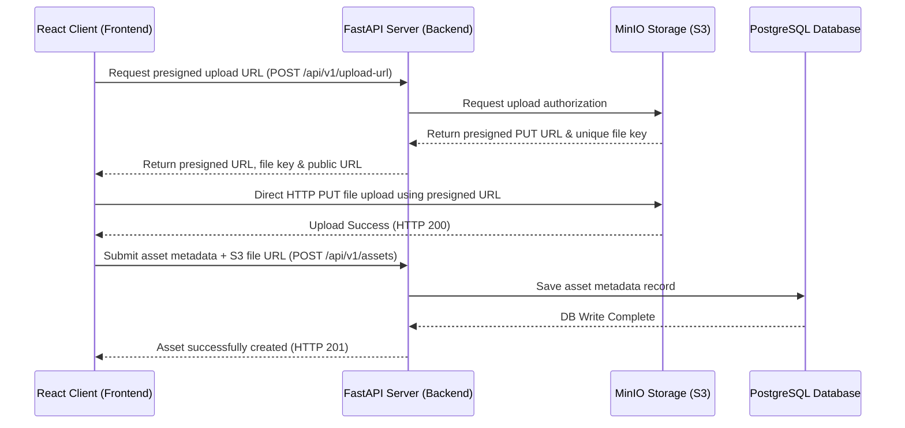

# AR Headless CMS

A headless Content Management System (CMS) designed for managing Augmented Reality (AR) assets, including 3D models (`.glb`), audio files, and marker images.

This repository contains a **FastAPI backend** that coordinates direct-to-S3 object uploads via presigned URLs and saves asset metadata in a **PostgreSQL database**, and a **Vite + React frontend** featuring a live 3D preview using Google's `<model-viewer>`.

---

## Architecture Overview



1. **Client** requests a temporary presigned upload URL from the **FastAPI Backend**.
2. **FastAPI Backend** interacts with **MinIO (S3)** to generate the URL and returns it to the client.
3. **Client** uploads the raw file directly to **MinIO (S3)**, reducing server load.
4. **Client** sends the asset metadata (including S3 public file URL) to **FastAPI Backend** to store in **PostgreSQL**.

---

## Tech Stack

- **Backend**: Python 3.11+, FastAPI, SQLAlchemy (Async), Uvicorn, `aioboto3` (Async S3 client)
- **Database**: PostgreSQL 15, SQL/ORM via SQLAlchemy Async Session
- **Object Storage**: MinIO (Local S3-compatible service)
- **Database UI**: Adminer (simple UI client for PostgreSQL)
- **Frontend**: React 19, Vite 8, Tailwind CSS 3, Axios, `@google/model-viewer` (3D web component)
- **Code Quality**: Oxlint (ultra-fast JS/TS linter)

---

## Environment Configuration

This project is fully parameterized for deployment. Rather than using hardcoded URLs, the frontend and backend communicate using environment variables. This allows you to host the frontend and backend at completely different locations (e.g., different domains or ports).

### Key Environment Variables

Define these in your root `.env` file:

| Variable | Scope | Description | Default / Local |
| :--- | :--- | :--- | :--- |
| `VITE_API_BASE_URL` | Frontend | Base URL of the backend API, used by the centralized [api.js](file:///D:/вігня на робочому/CMS/frontend/src/services/api.js) client. | `http://localhost:8000` |
| `CORS_ORIGINS` | Backend | Comma-separated list of permitted frontend origins for CORS. | `http://localhost:5173` |
| `VITE_CLERK_PUBLISHABLE_KEY` | Frontend | Clerk Publishable Key to initialize auth on the client. | *(Optional)* |
| `CLERK_PUBLISHABLE_KEY` | Backend | Clerk Publishable Key (used by backend to derive JWKS URL for JWT validation). | *(Optional)* |
| `CLERK_JWKS_URL` | Backend | Explicit JWKS URL for verifying Clerk authentication tokens. | *(Derived from key)* |

---

## Project Structure

```text
CMS/
├── app/                  # FastAPI Backend source code
│   ├── database.py       # Async SQLAlchemy engine/session config
│   ├── main.py           # API endpoints (FastAPI app with CRUD + S3 upload helper)
│   ├── models.py         # SQLAlchemy database models (including is_public & owner_id)
│   ├── schemas.py        # Pydantic schemas (validation)
│   └── s3_service.py     # MinIO / R2 S3 helper (presigned URL & bucket policy manager)
├── frontend/             # Vite + React Frontend project
│   ├── src/
│   │   ├── components/   
│   │   │   ├── AssetForm.jsx    # Asset Upload Form (with Clerk ownership & visibility toggle)
│   │   │   └── AssetGallery.jsx  # Asset Gallery (3D model, audio, and marker renderer)
│   │   ├── App.jsx       # Main component (tab navigation & Clerk auth gates)
│   │   └── main.jsx      # React mounting (with ClerkProvider wrapper)
│   ├── dockerfile        # Frontend Docker config
│   └── package.json      # Frontend JS dependencies & scripts
├── docker-compose.yml    # Orchestrator (configured with global CORS parameters)
├── dockerfile            # Backend Docker config
├── requirements.txt      # Python backend requirements
└── .env.example          # Template environment configurations
```


---

## Quick Start (Docker Compose)

The easiest way to run the entire stack is via **Docker Compose**. In this mode, a single `.env` file in the root directory manages the configuration for all services (PostgreSQL, MinIO, Backend, and Frontend).

1. **Clone the repository**:
   ```bash
   git clone https://github.com/Dreenck/CMS-for-managing-AR-assets.git
   cd CMS-for-managing-AR-assets
   ```

2. **Configure environment variables (Root Only)**:
   Copy `.env.example` in the **root** folder to `.env`:
   ```bash
   cp .env.example .env
   ```
   Open the root `.env` file and configure your settings (e.g., Clerk API Keys, database, etc.).
   > [!IMPORTANT]
   > You **do not** need to copy or configure any `.env` files inside the `frontend` folder when using Docker Compose. The environment variables from the root `.env` are automatically mapped and injected into both containers.

3. **Start all services**:
   ```bash
   docker compose up --build
   ```

Once started, the services will be available at:
* **Frontend**: [http://localhost:5173](http://localhost:5173)
* **Backend API**: [http://localhost:8000](http://localhost:8000)
* **Interactive API Reference (Scalar)**: [http://localhost:8000/scalar](http://localhost:8000/scalar)
* **MinIO Console**: [http://localhost:9001](http://localhost:9001) (Access: `minio_admin` / `minio_password`)
* **Adminer (Database GUI)**: [http://localhost:8080](http://localhost:8080) (Select DB: `PostgreSQL`, System: `postgres_db`, DB Name: `cms_database`, User: `cms_admin`, Password: `cms_password`)

### Authentication & Security (Clerk Setup)

This project integrates **Clerk** for Role-Based Access Control (RBAC) on both the React frontend and FastAPI backend:

#### 1. Developer Bypass Mode
* If `VITE_CLERK_PUBLISHABLE_KEY` is left blank in `.env`, the application automatically runs in **Dev Mode**, bypassing authentication checks.
* In Dev Mode, you will have automatic access to the **Admin Dashboard** and full rights to create, update, and delete any assets.

#### 2. Creating an Admin User
To promote yourself to an administrator:
1. Open the [Clerk Dashboard](https://dashboard.clerk.com/) and go to **Users**.
2. Click on your user account and scroll down to the **Metadata** section.
3. Under **Public Metadata**, enter the role claim:
   ```json
   {
     "role": "admin"
   }
   ```
4. Click **Save** and re-login on the frontend. The Admin Dashboard tab will now appear.

#### 3. Endpoint Security Rules
* **Read (`GET /api/v1/assets`)**: Public assets are readable by anyone. Logged-in non-admins can retrieve their own private assets. Administrators can retrieve all assets in the database.
* **Create (`POST /api/v1/assets`)**: Requires a valid Bearer token. The backend automatically associates the authenticated user's ID to prevent owner spoofing.
* **Update / Delete (`PUT` & `DELETE` /api/v1/assets/{id})**: Requires that the user is the **Owner** of the asset **OR** has the `admin` role in their metadata.

---

## Local Development (Manual Setup)

If you prefer to run services locally on your host OS without Docker, you will need to set up the backend and frontend separately. This requires configuring a `.env` file in **both** folders.

### 1. Prerequisites
- Python 3.11+
- Node.js 18+ & npm
- PostgreSQL running locally or remotely
- MinIO (or AWS S3 bucket) running locally

### 2. Backend Setup
1. Navigate to the root directory and create a virtual environment:
   ```bash
   python -m venv .venv
   source .venv/bin/activate  # On Windows: .venv\Scripts\activate
   ```
2. Install dependencies:
   ```bash
   pip install -r requirements.txt
   ```
3. **Configure Environment Variables**:
   Copy `.env.example` in the **root** directory to `.env` and fill in your local Postgres and MinIO credentials:
   ```bash
   cp .env.example .env
   ```
4. Run the development server:
   ```bash
   uvicorn app.main:app --reload
   ```
   The backend will be running at `http://127.0.0.1:8000`.

### 3. Frontend Setup
1. Navigate to the `frontend/` directory:
   ```bash
   cd frontend
   ```
2. **Configure Environment Variables**:
   Copy the `frontend` environment template to `.env`:
   ```bash
   cp .env.example .env
   ```
   Open `frontend/.env` and define:
   * `VITE_API_BASE_URL` (usually `http://localhost:8000` to point to the backend API)
   * `VITE_CLERK_PUBLISHABLE_KEY` (if you are using Clerk authentication)
3. Install JS dependencies:
   ```bash
   npm install
   ```
4. Start the Vite dev server:
   ```bash
   npm run dev
   ```
   The frontend will be running at `http://localhost:5173`.
5. Lint code:
   ```bash
   npm run lint
   ```

---

## API Documentation

- **Interactive API Documentation** is powered by **Scalar** and can be accessed at:
  `/scalar` (e.g., `http://localhost:8000/scalar` or `http://127.0.0.1:8000/scalar`).
- **OpenAPI Schema** is auto-generated at `/openapi.json`.

### Key Endpoints

| Method | Endpoint | Security | Description |
| :--- | :--- | :--- | :--- |
| `POST` | `/api/v1/upload-url` | Public | Validate constraints and generate presigned S3 upload URL. |
| `POST` | `/api/v1/assets` | User Token | Save asset metadata to DB. Sets owner from authenticated token. |
| `GET` | `/api/v1/assets` | Optional | Retrieve list of assets (Non-admins receive only public + owned assets). |
| `PUT` | `/api/v1/assets/{asset_id}` | Owner / Admin | Update title, description, or visibility metadata. |
| `DELETE` | `/api/v1/assets/{asset_id}` | Owner / Admin | Deletes asset metadata from DB and deletes file from S3 storage. |

---

## License

This project is licensed under the MIT License. See [LICENSE](LICENSE) for details.
