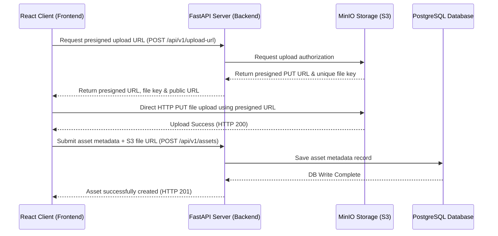

# AR Headless CMS

A headless Content Management System (CMS) designed for managing Augmented Reality (AR) assets, including 3D models (`.glb`), audio files, and marker images.

This repository contains a **FastAPI backend** that coordinates direct-to-S3 object uploads via presigned URLs and saves asset metadata in a **PostgreSQL database**, and a **Vite + React frontend** featuring a live 3D preview using Google's `<model-viewer>`.

---

## Architecture Overview



1. **Client** requests a temporary presigned upload URL from the **FastAPI Backend**.
2. **FastAPI Backend** interacts with **MinIO (S3)** to generate the URL and returns it to the client.
3. **Client** uploads the raw file directly to **MinIO (S3)**, reducing server load.
4. **Client** sends the asset metadata (including S3 public file URL) to **FastAPI Backend** to store in **PostgreSQL**.

---

## Tech Stack

- **Backend**: Python 3.11+, FastAPI, SQLAlchemy (Async), Uvicorn, `aioboto3` (Async S3 client)
- **Database**: PostgreSQL 15, SQL/ORM via SQLAlchemy Async Session
- **Object Storage**: MinIO (Local S3-compatible service)
- **Database UI**: Adminer (simple UI client for PostgreSQL)
- **Frontend**: React 19, Vite 8, Tailwind CSS 3, Axios, `@google/model-viewer` (3D web component)
- **Code Quality**: Oxlint (ultra-fast JS/TS linter)

---

## Project Structure

```text
CMS/
├── app/                  # FastAPI Backend source code
│   ├── database.py       # Async SQLAlchemy engine/session config
│   ├── main.py           # API endpoints (FastAPI app)
│   ├── models.py         # SQLAlchemy database models (PostgreSQL)
│   ├── schemas.py        # Pydantic schemas (validation)
│   └── s3_service.py     # MinIO / S3 helper methods (presigned URL gen)
├── frontend/             # Vite + React Frontend project
│   ├── src/
│   │   ├── components/   # React components (AssetForm.jsx)
│   │   ├── App.jsx       # Main application entry component
│   │   └── main.jsx      # React DOM client mounting
│   ├── dockerfile        # Frontend Docker config
│   └── package.json      # Frontend JS dependencies & scripts
├── docker-compose.yml    # Main multi-container orchestrator
├── dockerfile            # Backend Docker config
├── requirements.txt      # Python backend requirements
└── .env.example          # Template environment configurations
```

---

## Quick Start (Docker Compose)

The easiest way to run the entire stack is via **Docker Compose**:

1. **Clone the repository**:
   ```bash
   git clone https://github.com/Dreenck/CMS-for-managing-AR-assets.git
   cd CMS-for-managing-AR-assets
   ```

2. **Configure environment variables**:
   Copy `.env.example` to `.env` and adjust the variables if needed.
   ```bash
   cp .env.example .env
   ```

3. **Start all services**:
   ```bash
   docker compose up --build
   ```

Once started, the services will be available at:
* **Frontend**: [http://localhost:5173](http://localhost:5173)
* **Backend API**: [http://localhost:8000](http://localhost:8000)
* **Interactive API Reference (Scalar)**: [http://localhost:8000/scalar](http://localhost:8000/scalar)
* **MinIO Console**: [http://localhost:9001](http://localhost:9001) (Access: `minio_admin` / `minio_password`)
* **Adminer (Database GUI)**: [http://localhost:8080](http://localhost:8080) (Select DB: `PostgreSQL`, System: `postgres_db`, DB Name: `cms_database`, User: `cms_admin`, Password: `cms_password`)

---

## Local Development (Manual Setup)

If you prefer to run services locally without Docker, follow these instructions.

### 1. Prerequisites
- Python 3.11+
- Node.js 18+ & npm
- PostgreSQL running locally or remotely
- MinIO (or AWS S3 bucket)

### 2. Backend Setup
1. Navigate to the root directory and create a virtual environment:
   ```bash
   python -m venv .venv
   source .venv/bin/activate  # On Windows: .venv\Scripts\activate
   ```
2. Install dependencies:
   ```bash
   pip install -r requirements.txt
   ```
3. Set up environment variables (copy `.env.example` to `.env` and fill in local configs).
4. Run the development server:
   ```bash
   uvicorn app.main:app --reload
   ```
   The backend will be running at `http://127.0.0.1:8000`.

### 3. Frontend Setup
1. Navigate to the `frontend/` directory:
   ```bash
   cd frontend
   ```
2. Install JS dependencies:
   ```bash
   npm install
   ```
3. Start the Vite dev server:
   ```bash
   npm run dev
   ```
   The frontend will be running at `http://localhost:5173`.
4. Lint code:
   ```bash
   npm run lint
   ```

---

## API Documentation

- **Interactive API Documentation** is powered by **Scalar** and can be accessed at:
  `/scalar` (e.g., `http://localhost:8000/scalar` or `http://127.0.0.1:8000/scalar`).
- **OpenAPI Schema** is auto-generated at `/openapi.json`.

### Key Endpoints

| Method | Endpoint | Description |
| :--- | :--- | :--- |
| `POST` | `/api/v1/upload-url` | Generate presigned S3 upload URL for a file. |
| `POST` | `/api/v1/assets` | Save asset metadata (title, type, description, public URL) to database. |
| `GET` | `/api/v1/assets` | Retrieve list of all uploaded assets. |

---

## License

This project is licensed under the MIT License. See [LICENSE](LICENSE) for details.
